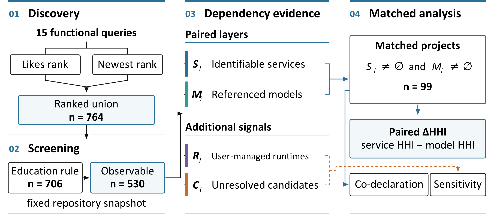

# EduAI CLDA

<div align="center">

Research code, derived data, and figures for  
**“Model Plurality, Service Concentration: A Cross-Layer Audit of Public Educational AI Projects”**

[](https://github.com/fly-01NN/eduai-clda/tree/v0.1.0)
[](pyproject.toml)
[](LICENSE)
[](LICENSE-DATA.md)



*Visible application variety can coexist with concentrated service interfaces.*

</div>

Public educational-AI projects can reference models from many publishers while
declaring inference services from a narrower set of providers. This repository
implements the **Cross-Layer Dependency Audit (CLDA)** used to compare those
layers in a frozen, query-defined set of public Hugging Face Spaces. The audit
keeps the project as the common unit, uses fractional attribution within each
layer, validates the measurement rules independently, and tests the result
under discovery, evidence, taxonomy, source-reuse, and provider alternatives.

## Artifact at a glance

| Component | Included | What it supports |
|---|:---:|---|
| Frozen protocol and analysis code | Yes | Search frame, classification rules, dependency parsing, concentration estimates, robustness analyses, and figures |
| Derived project and dependency tables | Yes | Offline reproduction of the main same-project comparison and reported sensitivity results |
| De-identified validation labels | Yes | Reproduction of weighted rule-precision estimates, agreement measures, and the service-omission audit |
| Statistical and QA records | Yes | 68 structural and numerical checks, source manifests, evidence gates, and analysis seeds |
| Final figures | Yes | PDF and editable SVG for Figures 1–5, plus a PNG overview for repository display |

The package does not redistribute downloaded source-code bodies, raw API
responses, or the private reviewer packages. Public project and model
identifiers are retained where needed to audit the frozen frame and derived
edges. The exact boundary is documented in
[docs/DATA_SHARING.md](docs/DATA_SHARING.md).

## Quick start

Python 3.11 or later and [uv](https://docs.astral.sh/uv/) are recommended.

```bash
git clone https://github.com/fly-01NN/eduai-clda.git
cd eduai-clda
```

From the repository root:

```bash
uv sync --frozen --group dev
uv run pytest -q
```

The tagged `v0.1.0` release completes with:

```text
76 passed
```

Verify the released files before running an analysis:

```bash
sha256sum -c MANIFEST.sha256
```

## Reproduce the public results

Recompute the analysis tables from the frozen derived inputs:

```bash
uv run python src/analyze_dependencies.py --root .
```

Reproduce the independent-review statistics from the de-identified labels:

```bash
uv run python src/reproduce_validation.py --root .
```

Run the 68 consistency checks after either command:

```bash
uv run python src/audit_results.py --root .
```

The audit exits successfully only when all hard checks pass. For a detailed
order of operations and the boundary between offline reproduction and renewed
network collection, see [docs/REPRODUCTION.md](docs/REPRODUCTION.md).

## Rebuild the figures

Figures 2--5 can be regenerated from the released tables. Figure 1 is a
directly drawn schematic whose editable SVG, final PDF, and source values are
included in the repository.

```bash
uv run python src/make_figures.py --root .
```

New PDF, SVG, PNG, TIFF, and figure-source files are written under `outputs/`;
the versioned final vectors remain in `figures/`.

Figure 4 reports Shannon effective counts and mutual information in nats.
Figure 5 distinguishes unknown categories defined by candidate type--identifier
pairs from those assigned separately to each project. It also shows the result
of pooling unmapped model namespaces for all 99 matched projects. All plotted estimates come from the released
analysis tables.

| Figure | Evidence shown | Public reconstruction route |
|---|---|---|
| Figure 1 | Frozen discovery, screening, dependency evidence, and matched analysis | Editable direct SVG and source values |
| Figure 2 | Intersections among identifiable services, model references, user-managed runtimes, and unresolved candidates | `src/make_figures.py` |
| Figure 3 | Model composition conditional on each declared inference service | `src/make_figures.py` |
| Figure 4 | Paired concentration estimates and service–model co-declaration association | `src/make_figures.py` |
| Figure 5 | Matched HHI differences (service minus model) across design variants | `src/make_figures.py` |

## Repository structure

```text
.
├── analysis_results/       # Numerical estimates, resamples, and sensitivity outputs
├── config/                 # Frozen protocol record
├── data/
│   ├── figure_source/      # Author-created data used by Figures 1–5
│   ├── processed/          # Frozen project, dependency, model, and history tables
│   └── qa/                 # Collection manifests and statistical QA records
├── docs/                   # Data contracts, sharing boundary, and reproduction guide
├── figures/                # Final PDF/SVG figures and the Figure 1 PNG preview
├── src/                    # Collection, parsing, analysis, validation, and plotting code
├── tests/                  # Deterministic tests using synthetic or temporary inputs
├── CITATION.cff            # Machine-readable citation metadata
├── MANIFEST.sha256         # Release-integrity checksums
├── pyproject.toml          # Python dependencies and test configuration
└── uv.lock                 # Locked software environment
```

## Responsible reconstruction

The released result path is offline. Collection scripts are included for
methodological inspection and independent reconstruction, but they can contact
public APIs or repositories. Before any renewed collection, review current
provider terms and institutional requirements, use conservative request rates,
and set an honest user agent with a monitored contact address:

```bash
export EDUAI_CLDA_USER_AGENT="EduAI-CLDA/0.1.0 (research; contact: you@example.org)"
```

Do not use the collectors to bypass access controls. A fresh collection is a
new snapshot and should not silently replace the frozen 2026-08-31 results.

## Citation

Machine-readable metadata are provided in [CITATION.cff](CITATION.cff). The
article DOI can be added after publication.

## Pre-submission version policy

Until the manuscript is submitted, the package version remains `0.1.0`.
The `main` branch and `v0.1.0` tag point to a single current snapshot commit;
updates replace that snapshot and its history. Save the commit identifier and
`MANIFEST.sha256` alongside any downloaded copy to identify its exact contents.
Maintainers retain a recovery backup before replacing the remote references.
This release policy does not change the frozen study protocol or its version.

## Licences

- Code, tests, and software documentation are released under the
  [MIT License](LICENSE).
- Author-created derived data, aggregate results, and figures are released
  under [CC BY 4.0](LICENSE-DATA.md).
- Third-party repositories, model records, APIs, names, and trademarks retain
  their original rights and are not relicensed by this repository.

Questions and reproducibility issues can be reported through the repository's
[issue tracker](https://github.com/fly-01NN/eduai-clda/issues).
